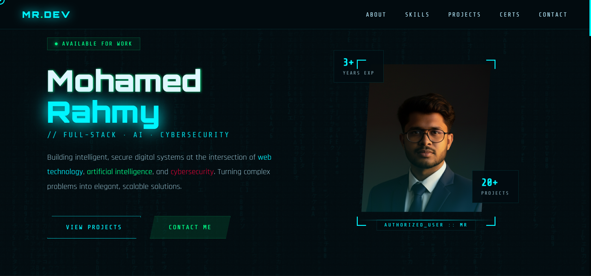

# 🚀 Hi there, I'm Mohamed Rahmy! 

### **Full-Stack Developer | AI Enthusiast | Cybersecurity Specialist**

Building intelligent, secure digital systems at the intersection of **Web Technology**, **Artificial Intelligence**, and **Cybersecurity**. Turning complex problems into elegant, scalable solutions.

---

### 🛠 **About Me**

- 🎓 **Undergraduate** at University of Moratuwa (BIT).
- 🛡️ **Certified Ethical Hacker (CEH v11)** & Cisco Certified professional.
- 🏗️ **3+ Years of Experience** in crafting digital solutions.
- 📂 Successfully delivered **20+ Projects**.
- 🌱 Focused on **AI integration** and **Secure Web Architectures**.

---

### 💻 **Skills & Expertise**

| Category | Technologies |
| :--- | :--- |
| **Development** | JavaScript, Python, C/C++, React, Node.js |
| **Cybersecurity** | Ethical Hacking (CEH), OSINT, Network Security |
| **AI & Networking** | Machine Learning, Cisco Verified Certifications |
| **Tools** | Git, Linux, VS Code, Burp Suite |

---

### 📊 **GitHub Statistics**

---

### 📫 **Connect with Me**

- 💼 [LinkedIn](https://linkedin.com/in/YOUR_PROFILE)
- 🌐 [Portfolio](https://YOUR_PORTFOLIO_LINK)
- 📧 [Email](mailto:YOUR_EMAIL@example.com)

---

> *"Securing the future, one line of code at a time."*
